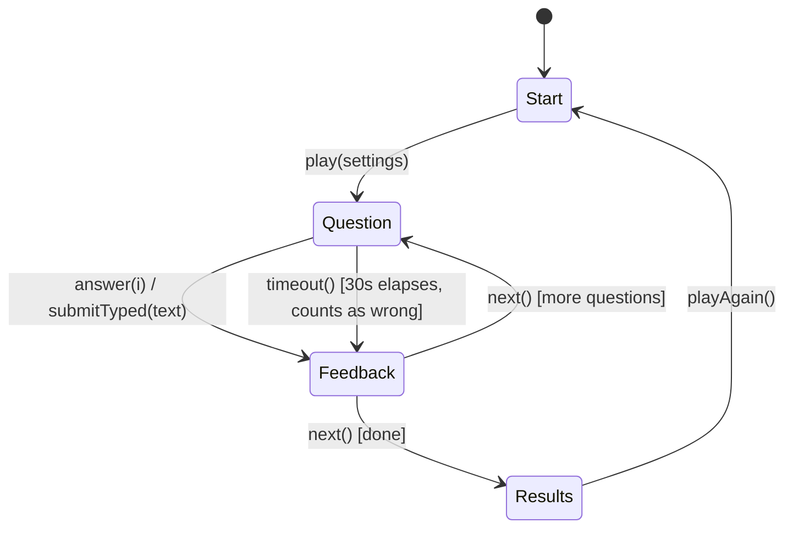
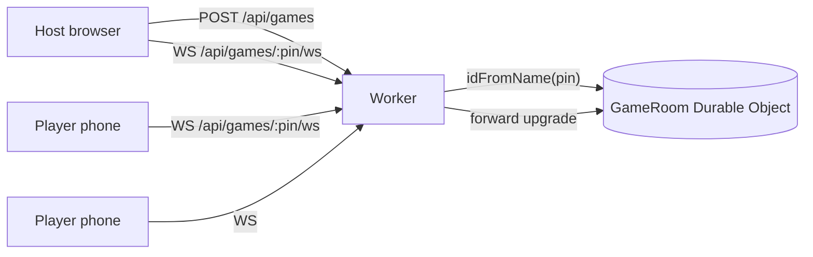
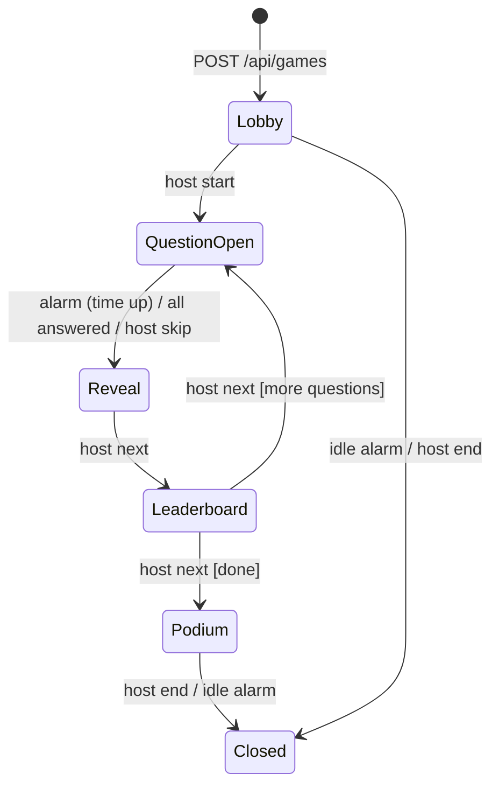

# Plan: "Tag, You're Obsolete" — A Quiz on Obscure & Deprecated HTML Elements

## 1. Goal

A browser-based quiz that tests players on old, obscure, and deprecated HTML elements: what they did, where they came from, and what replaced them. It has two modes:

- **Solo**: runs entirely client-side, with no backend or account.
- **Live**: a Kahoot-style multiplayer mode. A host puts the questions on a shared screen, players join from their phones with a game PIN, and everyone races the same clock (§7). This mode needs a small real-time backend on Cloudflare Workers.

## 2. Tech Choice

| Layer | Choice | Why |
|---|---|---|
| Frontend | **Vanilla HTML/CSS/JS (ES modules)** | A handful of screens that fit the retro-web theme. React/Vue/Svelte would be overkill. The source is plain JS; Vite only serves it in dev and bundles it for production. |
| Live backend | **Cloudflare Workers + Durable Objects** | One Durable Object per game room gives a single consistent place for game state, WebSocket fan-out, and server-side timers, with no database or server to manage. |
| Hosting | **Workers Static Assets on `quiz.qkleinfelter.com`** (same Worker serves the site and `/api/*`) | Same origin for pages and WebSockets means no CORS and a simpler CSP. `qkleinfelter.com` is already a zone on the Cloudflare account, so a subdomain is all that's needed. |
| Tooling | **`cf` CLI** (open beta, `npm i -g cf`) with **`cloudflare.config.ts`** and the **Cloudflare Vite plugin** | `cf` replaces Wrangler. Its config is typed TypeScript, and Vite is the default dev server and build. |

- ES modules keep the code organized. Local dev runs through the Vite dev server with the Cloudflare Vite plugin, which runs the Worker, the Durable Object, and the static pages together in the Workers runtime.
- CSS custom properties for theming.
- `localStorage` for Solo high scores and settings; `sessionStorage` for a Live player's reconnect token.
- Pure game logic (question generation, answer matching, scoring) lives in one shared folder, imported by both the browser and the Worker, so the rules can't drift between modes.
- Dev dependencies: `cf`, `vite`, the Cloudflare Vite plugin, `vitest`, and Cloudflare's Vitest integration for Durable Object tests.
- **`cf` is in open beta.** Look up exact command and binding-helper names with `cf cli search "<task>"` and editor autocompletion on `cf/config` rather than assuming Wrangler equivalents. Wrangler stays available as a fallback, since `cf` can still delegate to it.

## 3. Features

The levels, question types, and element pools below apply to **both** Solo and Live mode. Live-specific flow and scoring are in §7.

### MVP (Solo)
1. **Start screen**: title, **Play Solo** and **Host a Live Game** / **Join a Live Game** buttons, a single **Level** picker (**Easy** / **Medium** / **Hard**, see table below), and question count (10 / 20 / All).
2. **Quiz loop**: one question at a time, a 30-second countdown per question (configurable in settings, auto-submits whatever is selected/typed when it hits zero), and immediate feedback (correct/incorrect) followed by a short explanation and a "fun fact".
3. **Levels** — difficulty is one axis that drives both the input mode and which elements (by their own `difficulty` field, see §4) are eligible for a round:

   | Level | Input mode | Element pool (by `difficulty`) | Distractors / matching |
   |---|---|---|---|
   | **Easy** | Multiple choice (4 buttons). Keys 1–4 select an answer. | `easy` only | Distractors from other `easy` elements, kept clearly distinct |
   | **Medium** | Multiple choice (4 buttons). Keys 1–4 select an answer. | `easy` + `medium` | Distractors skew toward closer, easier-to-confuse wording drawn from the same tier |
   | **Hard** | Typed free-text answer via a text `<input>`. Enter submits. | `medium` + `hard` (the full "obscure" end of the bank) | Matched by `answerMatch.js` against each element's `aliases`: case-insensitive, trimmed, with or without angle brackets (`marquee`, `<marquee>`, `Marquee` all match); a short alias list handles variants (e.g. `frame`/`frameset`) |

   Every element needs at least one entry in `aliases` (§5) since any element tagged `medium` or `hard` can appear as a Hard-level typed question.
4. **Question types**
   - **What did it do?**: "What did `<blink>` do?"
   - **Name the tag**: "Which element made text scroll across the screen?" → `<marquee>`
   - **What replaced it?**: "`<acronym>` was superseded by…" → `<abbr>`
   - **Origin**: "Which browser or spec introduced `<bgsound>`?" → Internet Explorer
   - **Live specimen**: show a rendered demo of the element in a sandboxed iframe where browsers still support it (e.g. `<marquee>`, `<center>`, `<font>`, `<details>`), then ask the player to identify it.
5. **Scoring**: points per correct answer (Hard awards more than Medium, which awards more than Easy, to reflect typed input and a tougher pool), a speed bonus for answering well under 30 seconds, a streak bonus, and a final results screen with a per-question review.
6. **High scores** stored in `localStorage`, one per level (Easy/Medium/Hard).
7. **Keyboard support**: keys 1–4 select an answer on Easy/Medium, Enter submits the typed answer on Hard or advances on the feedback screen.

### Stretch
- Adjustable timer lengths (15s / 30s / 60s / off) beyond the 30s default
- **"Museum" / glossary page** listing every element with its history, unlocked as the player encounters each one
- "Retro mode" theme toggle (Comic Sans, tiled background, a visitor counter, "Under Construction" GIF styling done with CSS)
- Share a result as text ("I scored 17/20 on Tag, You're Obsolete")
- Daily challenge (a seeded shuffle based on the date)

## 4. Content: Element Bank

Includes both genuinely obsolete/removed elements and elements that are still valid HTML5 but obscure enough that most developers couldn't say what they do. `status` distinguishes them (see §5); the quiz UI labels a question "still valid, just obscure" when relevant so players aren't misled into thinking a live element is dead.

### Obsolete / deprecated / removed

| Element | What it did | Replaced by / fate | Difficulty |
|---|---|---|---|
| `<blink>` | Blinking text (Netscape) | CSS animation; no longer supported | Easy |
| `<marquee>` | Scrolling text (IE) | CSS animation; still renders in most browsers | Easy |
| `<center>` | Centered content | `text-align` / flexbox | Easy |
| `<font>` | Font face, size, and color | CSS | Easy |
| `<frameset>` / `<frame>` | Split the window into frames | `<iframe>`, CSS layout | Easy |
| `<strike>` | Strikethrough | `<s>` / `<del>` | Easy |
| `<big>` | Larger text | CSS `font-size` | Easy |
| `<tt>` | Teletype (monospace) text | `<code>`, `<kbd>`, `<samp>`, CSS | Medium |
| `<acronym>` | Acronym markup | `<abbr>` | Medium |
| `<applet>` | Embedded Java applet | `<object>` / `<embed>`; Java plugins removed | Medium |
| `<basefont>` | Default font for a page | CSS | Medium |
| `<bgsound>` | Background audio (IE) | `<audio>` | Medium |
| `<dir>` | Directory list | `<ul>` | Medium |
| `<noframes>` | Fallback for non-frame browsers | Obsolete alongside frames | Medium |
| `<nobr>` | Prevented line breaks | CSS `white-space: nowrap` | Medium |
| `<keygen>` | Generated a key pair in forms | Web Crypto API; removed in Chrome 57 and Firefox 69 | Hard |
| `<isindex>` | Single-line search prompt (HTML 2.0) | `<form>` + `<input>` | Hard |
| `<listing>` | Preformatted code listing | `<pre>` | Hard |
| `<xmp>` | Example text, with HTML not parsed | `<pre>` + escaping | Hard |
| `<plaintext>` | Treated everything after it as raw text, with no closing tag | `<pre>` | Hard |
| `<spacer>` | Whitespace (Netscape) | CSS margin/padding | Hard |
| `<multicol>` | Multi-column layout (Netscape) | CSS multi-column layout | Hard |
| `<layer>` / `<ilayer>` | Positioned layers (Netscape 4) | CSS positioning | Hard |
| `<menuitem>` | Context menu items (Firefox) | Removed (Firefox 85) | Hard |
| `<image>` | Alias the parser turns into `` | `` | Hard |
| `<nextid>` | Editor ID hint (HTML 2.0) | Obsolete | Hard |
| `<rb>` / `<rtc>` | Ruby base and ruby text container | Plain `<ruby>` + `<rt>` | Hard |
| `<noembed>` | Fallback for `<embed>` | Obsolete | Hard |
| `<content>` / `<shadow>` | Shadow DOM v0 insertion points | `<slot>` (Shadow DOM v1) | Hard |

### Still valid, just obscure (non-deprecated)

| Element | What it does | Why it's obscure | Difficulty |
|---|---|---|---|
| `<wbr>` | Marks an optional line-break point inside a word | Rarely needed, invisible unless a break actually happens | Medium |
| `<bdo>` | Overrides text direction (LTR/RTL) | Only matters for bidirectional-text edge cases | Hard |
| `<bdi>` | Isolates text from surrounding bidirectional formatting | Same niche as `<bdo>`, easy to confuse with it | Hard |
| `<data>` | Attaches a machine-readable value to human-readable content | Overshadowed by `<time>`, which does the date-specific version | Medium |
| `<output>` | Displays the result of a calculation or user action in a form | Niche form-only use case | Medium |
| `<meter>` | A scalar measurement within a known range (e.g. disk usage) | Visually similar to `<progress>`, often confused with it | Medium |
| `<progress>` | Completion progress of a task | Often reached for `<meter>`'s job by mistake | Easy |
| `<dfn>` | Marks the defining instance of a term | Rarely used outside glossaries/specs | Hard |
| `<kbd>` | Represents keyboard input | Known to some, but often replaced with `<code>` incorrectly | Medium |
| `<samp>` | Sample output from a program | Confused with `<kbd>` and `<code>` | Hard |
| `<var>` | A variable in a math or programming context | Rarely styled distinctly, so its purpose is invisible | Hard |
| `<q>` | Inline (short) quotation, auto-adds quote marks | Developers reach for plain quote characters instead | Medium |
| `<ins>` / `<del>` | Marks inserted/deleted content (e.g. tracked changes) | Confused with `<s>`; rarely used outside diff-style UIs | Medium |
| `<ruby>` / `<rt>` / `<rp>` | Ruby annotations (e.g. furigana above CJK text) | Essentially unknown outside East Asian typesetting | Hard |
| `<details>` / `<summary>` | Native collapsible disclosure widget | Underused despite replacing a lot of custom JS accordions | Easy |
| `<dialog>` | Native modal/non-modal dialog element | Landed late (broad support ~2022) and still under-adopted | Medium |
| `<template>` | Inert HTML fragment parsed but not rendered until cloned | Purely a scripting primitive, invisible in markup review | Hard |
| `<picture>` | Wraps `<source>`/`` for responsive/art-directed images | Overshadowed by the simpler `` | Medium |
| `<track>` | Adds subtitles/captions/chapters to `<video>`/`<audio>` | Easy to miss since it's a child of media elements | Medium |
| `<slot>` | Placeholder in a Shadow DOM template for light-DOM content | Web Components-only, invisible without that context | Hard |
| `<portal>` (experimental) | Would preview/navigate to another page inline | Proposed, implemented behind a flag, then abandoned | Hard |

> Verify each fact against MDN and the WHATWG/HTML Standard "obsolete" and "non-conforming" feature lists before release. Store the source URL with each entry. For the experimental/abandoned row (`<portal>`), label it clearly as never having reached a standard so players aren't quizzed on it as if it were dead standard.

Total bank: about 30 obsolete/deprecated elements plus about 20 obscure-but-valid ones — roughly 50 entries. Each element's `difficulty` field feeds the level pools in §3 directly: Easy level draws only from `easy`-tagged elements, Medium from `easy`+`medium`, and Hard from `medium`+`hard`.

## 5. Data Model

`src/shared/data/elements.js` (a static JS module imported by both the browser and the Worker):

```js
export const elements = [
  {
    id: "marquee",
    tag: "<marquee>",
    aliases: ["marquee"],          // accepted typed answers for Hard mode (no brackets, lowercase)
    summary: "Scrolled text or images horizontally or vertically.",
    origin: "Internet Explorer",
    replacement: "CSS animations",
    status: "obsolete",            // obsolete | deprecated | non-standard | removed | still-valid
    difficulty: "easy",
    funFact: "Supported attributes like behavior=\"alternate\" to bounce text back and forth.",
    demo: "<marquee>Welcome to my homepage!</marquee>", // optional, trusted static markup
    source: "https://developer.mozilla.org/en-US/docs/Web/HTML/Element/marquee"
  },
  // ...
];
```

Questions are **generated** from element records at runtime:
- `questionTypes.js` defines generators such as `whatDidItDo(el, pool)` and `nameTheTag(el, pool)`. Each one returns `{ prompt, choices[], answerIndex, explanation, acceptedAnswers[], demo? }`. `choices`/`answerIndex` drive Easy mode; `acceptedAnswers` (normalized aliases) drive Hard mode.
- Distractors (Easy mode) are drawn from other elements in the same field (for example, other `summary` values), then shuffled.
- **Typed-answer matching** (Hard mode) lives in `answerMatch.js`: normalize the player's input (lowercase, trim, strip `<`/`>`/whitespace) and check it against `acceptedAnswers`. Kept as a pure function so it's unit-testable against tricky cases (`< Frame >`, `FRAMESET`, etc.).
- A small set of hand-written questions (`shared/data/custom-questions.js`) covers trivia that doesn't fit the generators.
- **Scoring** lives in `shared/scoring.js` so Solo and Live use the same rules and level multipliers. The Live server is the only thing that calls it in Live mode.

## 6. Architecture

```
elements-quiz/
├── cloudflare.config.ts        # cf config: Worker entry, GameRoom Durable Object, rate limits, quiz.qkleinfelter.com
├── vite.config.js              # Cloudflare Vite plugin; multi-page inputs (index/host/play)
├── package.json                # dev deps only (cf, vite, Cloudflare Vite plugin, vitest)
├── index.html                  # Solo mode + entry points to Live mode
├── host.html                   # Live: big-screen host view
├── play.html                   # Live: phone player view
├── public/                     # files copied as-is (favicon, retro images)
├── src/
│   ├── css/
│   │   ├── main.css
│   │   └── retro.css
│   ├── shared/                 # pure logic, no DOM, imported by browser AND Worker
│   │   ├── data/
│   │   │   ├── elements.js
│   │   │   └── custom-questions.js
│   │   ├── questionTypes.js
│   │   ├── answerMatch.js
│   │   ├── pools.js            # level -> eligible elements (§3 table)
│   │   ├── scoring.js
│   │   └── protocol.js         # Live message types + validators
│   ├── solo/
│   │   ├── main.js
│   │   ├── state.js            # Solo quiz state machine
│   │   ├── quiz.js
│   │   ├── timer.js            # countdown (Solo only; Live timing is server-side)
│   │   ├── storage.js
│   │   └── ui/
│   │       ├── startScreen.js
│   │       ├── questionScreen.js   # choice buttons (Easy/Medium) or text input (Hard) + countdown
│   │       ├── resultsScreen.js
│   │       └── specimen.js         # sandboxed iframe demos (also used by the Live host view)
│   ├── live/
│   │   ├── socket.js           # WebSocket wrapper: JSON framing, backoff reconnect, clock-offset estimate
│   │   ├── host.js             # host screen controller
│   │   └── player.js           # player screen controller
│   └── worker/
│       ├── index.js            # routes /api/*, everything else falls through to static assets
│       └── gameRoom.js         # Durable Object: one instance per live game
└── tests/
    ├── shared/                 # questionTypes, answerMatch, pools, scoring, protocol
    ├── solo/                   # state machine, timer
    └── worker/                 # GameRoom tests via Cloudflare's Vitest integration
```

Vite builds the three HTML pages into static assets that the Worker serves. It also bundles the Worker, which imports `src/shared/*` directly, so client and server share one copy of the game logic. The source stays plain JavaScript with no framework or transpile-only syntax.

`cloudflare.config.ts` sketch (use editor autocompletion or `cf cli search` to confirm the exact helper names for Durable Objects, rate limits, and custom domains during the beta):

```ts
import { bindings, defineConfig, triggers } from "cf/config";
import * as entrypoint from "./src/worker/index.js" with { type: "cf-worker" };

export default defineConfig(({ mode }) => ({
  worker: {
    name: "elements-quiz",
    entrypoint,
    compatibilityDate: "2026-09-30",
    env: {
      GAME_ROOM: /* Durable Object binding -> GameRoom class (SQLite-backed) */,
      CREATE_LIMITER: /* rate-limit binding: game creation per IP */,
      JOIN_LIMITER: /* rate-limit binding: WebSocket joins per IP */,
      ALLOWED_ORIGIN: bindings.text(
        mode === "production" ? "https://quiz.qkleinfelter.com" : "http://localhost:5173",
      ),
    },
    triggers: [/* custom domain: quiz.qkleinfelter.com */],
  },
}));
```

### Solo state machine



Each `Question` state starts a 30-second (default, configurable) timer via `timer.js`; it is cleared on answer/submit and forces a `timeout()` transition at zero, recording the question as incorrect with a "time's up" note. Keep the logic (`state.js`, `quiz.js`, `questionTypes.js`, `answerMatch.js`, `timer.js`) free of DOM access so it can be unit tested. UI modules subscribe to state changes and re-render.

## 7. Live Mode (Kahoot-style Multiplayer)

### Player experience
- **Host** (laptop or projector, `host.html`): picks a level, question count, and timer, then gets a **6-digit PIN** and a QR code linking to `https://quiz.qkleinfelter.com/play.html?pin=…`. The host screen shows the lobby, each question (prompt, choices, live specimen, countdown), the answer distribution, the leaderboard, and the final podium. It also has Start / Next / Skip / Kick / End controls.
- **Players** (phones, `play.html`): enter the PIN and a nickname, wait in the lobby, then answer on their phone:
  - **Easy/Medium**: four large buttons, each with a **color + shape + A/B/C/D label** (never color alone), plus the choice text on the phone.
  - **Hard**: a text input for the typed answer. The server matches it with the shared `answerMatch.js`.
  - After each question the phone shows the result: correct or incorrect, points earned, current rank, and streak.
- **Per question**: the question opens, players answer until the timer ends (30s default) or everyone has answered, then the correct answer and a distribution chart are shown, followed by the top-5 leaderboard, and the host moves on. The final screen is a top-3 podium.

### Scoring (server-authoritative, in `shared/scoring.js`)
- Correct answer: `round(basePoints × (1 − (responseTime / questionTime) / 2))`, where `basePoints` is 1000 × the level multiplier. A correct answer earns 50–100% of the base, and faster answers earn more.
- Wrong or missing answer: 0 points, and the streak resets.
- Streak bonus: a small flat bonus for 3 or more correct in a row.
- `responseTime` is measured **on the server** from the moment the question opened. Clients only get `endsAt` plus the server's time so they can draw an accurate countdown.

### Backend: Cloudflare Worker + Durable Object



- **`src/worker/index.js`** handles three things:
  - `POST /api/games` creates a game: it generates a random PIN with `crypto.getRandomValues`, initializes the `GameRoom` for that PIN (retrying if the PIN is already in use), and returns `{ pin, hostToken }`. It is rate-limited per IP.
  - `GET /api/games/:pin/ws` checks the `Origin` header against `ALLOWED_ORIGIN` and forwards the WebSocket upgrade to that PIN's `GameRoom`. It is rate-limited per IP to slow down PIN guessing.
  - Everything else is served from the Vite-built static assets.
- **`src/worker/gameRoom.js`** (one Durable Object per game):
  - Uses the **WebSocket Hibernation API** (`ctx.acceptWebSocket`, `webSocketMessage`, `webSocketClose`). Idle lobbies don't bill for duration, and each socket's player identity is kept with `serializeAttachment`.
  - Stores game state in **Durable Object storage**, not just memory, so it survives hibernation or eviction: settings, the question list with answers, players, scores, and the current phase.
  - Drives question timers with **`ctx.storage.setAlarm()`** rather than `setTimeout`, because alarms still fire after hibernation. The alarm closes the question, scores it, and broadcasts the reveal.
  - Cleans up after itself: an alarm deletes all storage (`deleteAll()`) after the game ends or after about 1 hour idle.
  - Enforces limits: **max 100 players per room**, one answer per player per question, and answers accepted only while a question is open, with a small latency grace period (about 500 ms).
- **Game generation** happens on the server with the same `pools.js` and `questionTypes.js` as Solo. Correct answers **never leave the server** until the reveal.

### Room state machine



### Message protocol (`shared/protocol.js`, JSON over WebSocket)

| Direction | `type` | Payload (summary) |
|---|---|---|
| host → server | `host.hello` | `hostToken` (sent in the first message, not in the URL, so it stays out of logs) |
| host → server | `host.start` / `host.next` / `host.skip` / `host.kick` / `host.end` | `playerId` for kick |
| player → server | `player.join` | `nickname` |
| player → server | `player.resume` | `playerToken` (reconnect after a phone sleeps) |
| player → server | `player.answer` | `questionId`, plus `choice` (0–3) **or** `text` (Hard, ≤ 40 chars) |
| server → all | `lobby` | player nicknames and count |
| server → player | `joined` | `playerId`, `playerToken` |
| server → host | `question` | index/total, prompt, choices, `demo`, `inputMode`, `endsAt`, `serverNow` |
| server → player | `question` | index/total, `inputMode`, choice labels/text, `endsAt`, `serverNow` (no answer index) |
| server → host | `answerCount` | answered / total |
| server → all | `reveal` | correct answer, distribution (counts only), plus each player's own result |
| server → all | `leaderboard` / `podium` | top N nicknames and scores |
| server → client | `error` | a stable `code` (`ROOM_FULL`, `NAME_TAKEN`, `BAD_PIN`, `NOT_OPEN`, …) |

Every incoming message is size-capped and validated against the schema in `protocol.js`. Unknown or invalid messages are dropped.

### Resilience
- **Player disconnect**: the player's score is kept, and `player.resume` with the `playerToken` from `sessionStorage` restores their seat.
- **Host disconnect**: the game pauses (the current question still closes when its timer runs out). The host can reconnect with `hostToken`. If they don't, the idle alarm ends the game.
- **Clock skew**: clients estimate their offset from `serverNow` and render the countdown against the server's `endsAt`. The server alone decides whether an answer arrived in time.

### Cost
The Workers Free plan covers small, casual games: SQLite-backed Durable Objects, and hibernation keeps idle lobbies cheap. Check current Workers and Durable Objects limits and pricing before any large event.

## 8. Security Considerations

### Solo and shared
- **Live specimens** render only trusted, hard-coded `demo` strings, inside `<iframe sandbox srcdoc="...">` with no `allow-scripts`. This keeps legacy markup such as `<plaintext>` from breaking the host page.
- All other dynamic text goes in through `textContent`, never `innerHTML`.
- Add a strict Content Security Policy (served as a response header by the Worker): `default-src 'self'; connect-src 'self'; frame-src 'self'; object-src 'none'`. Since the site and the WebSocket share an origin, `'self'` covers both.

### Live mode
- **No host accounts.** Anyone can host a game anonymously. Rate limits (below) are the only protection against abuse, which is enough for a casual quiz.
- **Nicknames are the only user-generated text shown to others.** They are trimmed, limited to 1–20 characters from an allow-listed set (letters, digits, spaces, basic punctuation), unique per room, and always rendered with `textContent`. The host can kick a player. An optional simple blocklist filters obvious profanity.
- **Typed Hard answers are never broadcast.** Only correct/incorrect counts appear on the host screen, which avoids a moderation problem on a projector.
- **Answers stay on the server** until the reveal, so reading the WebSocket traffic won't reveal them.
- **Authorization**: host actions require the `hostToken`, a random 128-bit value compared in constant time and sent in the first message rather than the URL. Player reconnects require a per-player `playerToken`. Neither token is logged.
- **Abuse limits**: rate-limit bindings (`CREATE_LIMITER`, `JOIN_LIMITER`) on game creation and WebSocket joins per IP (a 6-digit PIN space is guessable without them). The server also caps each room at 100 players and limits message size and messages per socket per second.
- **Origin check** on WebSocket upgrades: only `https://quiz.qkleinfelter.com` (or the local Vite origin in dev) is accepted, which rejects cross-site connections.
- **Data retention**: no accounts and no personal data beyond a nickname. All room storage is deleted when the game closes or goes idle.

## 9. UX & Accessibility

- Semantic, modern markup for the app itself, with the obsolete elements appearing only as quiz content.
- Answer buttons are real `<button>` elements with visible focus styles; the Hard-level text input has a visible label and autofocuses at the start of each question.
- The countdown is shown as both text ("0:07 left") and a shrinking bar, and is announced at 10s/5s/0s via an `aria-live="polite"` region — not color alone.
- Announce answer feedback through the same `aria-live="polite"` region.
- Respect `prefers-reduced-motion`: pause marquee and blink-style demos and show a static description instead.
- Meet WCAG AA color contrast in both the default and retro themes.
- Responsive layout down to about 320px wide.
- **Live**: phone answer buttons are large touch targets, and each one is distinguishable by shape and letter as well as color. The host view is readable from the back of a room (large type, high contrast). Connection status ("Reconnecting…") is shown on both host and player screens.

## 10. Implementation Milestones

### Phase 1: Solo
1. **Scaffold**: `npm i -g cf`, then `cf init` to set up the Cloudflare Vite plugin and `cloudflare.config.ts`. Add `vite.config.js` with the three HTML entry pages, `index.html`, CSS variables, and empty screen sections that toggle visibility. The Vite dev server serves it locally.
2. **Data**: write `elements.js` with about 50 verified entries (obsolete + obscure-but-valid), each with a `difficulty` tier and `aliases` for Hard-level matching.
3. **Shared core logic**: shuffle (Fisher–Yates), question generators, `answerMatch.js`, `pools.js` (§3 table), `scoring.js`, plus unit tests.
4. **Timer**: `timer.js` countdown (30s default), wired to force a timeout transition; pause behavior on tab blur.
5. **UI loop**: start → question (choice buttons for Easy/Medium, text input for Hard) → feedback → results, including keyboard controls.
6. **Specimens**: sandboxed iframe renderer and reduced-motion fallback.
7. **Persistence**: high scores and settings (level, timer length) in `localStorage`.
8. **Polish and deploy**: retro theme toggle, accessibility pass, and mobile layout. Add the `quiz.qkleinfelter.com` custom domain in `cloudflare.config.ts`, then run `cf deploy`.

### Phase 2: Live
9. **Worker skeleton**: `src/worker/index.js` routing, the `GameRoom` Durable Object binding in `cloudflare.config.ts`, and `POST /api/games` with PIN allocation.
10. **Protocol**: `shared/protocol.js` message types and validators, plus tests.
11. **GameRoom lobby**: hibernatable WebSockets, host hello/token check, player join/resume, nickname rules, and the lobby broadcast.
12. **Question loop**: server-side question generation, the `setAlarm` timer, answer collection, scoring, and reveal / leaderboard / podium broadcasts.
13. **Host and player UIs**: `host.html` (PIN, QR code, question, distribution, leaderboard, podium, controls) and `play.html` (join, answer buttons or text input, result feedback). `socket.js` handles reconnect and clock offset.
14. **Hardening**: rate-limit bindings, `ALLOWED_ORIGIN` check, message size and rate caps, the 100-player cap, idle cleanup alarm, kick, and host-disconnect handling.
15. **Load check and deploy**: simulate 100 players with a small script against the local dev server, then `cf deploy` to `quiz.qkleinfelter.com`.

## 11. Testing

- **Unit**: question generators always produce 4 unique choices with exactly one correct answer on Easy/Medium; `answerMatch.js` correctly accepts/rejects typed variants (case, whitespace, brackets, aliases) on Hard; the level-to-pool filter only draws elements whose `difficulty` matches the table in §3; shuffle output keeps every item; scoring, streak, and speed-bonus math is correct; timer fires `timeout()` exactly once at zero and is cleared on manual answer.
- **Data validation test**: every element has the required fields (including at least one `alias` for Hard-level matching), a valid `difficulty`/`status`, and a `source` URL.
- **Protocol**: validators accept every well-formed message type and reject oversized, malformed, or unknown ones.
- **GameRoom (Cloudflare Vitest integration)**:
  - A full game with a host and several players.
  - Answers after `endsAt` (plus grace) are rejected, and a second answer to the same question is ignored.
  - Correct answers never appear in any pre-reveal message sent to players.
  - The alarm closes a question after hibernation.
  - Player resume keeps the score; a bad `hostToken` is rejected.
  - Duplicate and invalid nicknames are refused; the room-full limit is enforced.
  - The idle alarm deletes storage.
- **Manual/E2E (optional Playwright)**:
  - Solo: play through a full game at each of the three levels, confirm the timer auto-submits on expiry, check keyboard navigation, and confirm high scores persist after a reload.
  - Live: one host page and several player pages play a full game, including a player reloading mid-question and the host reconnecting.

## 12. Resolved Decisions

- **Element scope**: both obsolete/deprecated/removed elements *and* obscure-but-valid elements are included (see §4); `status` field distinguishes them so the UI can label "still valid" correctly.
- **Levels**: a single Easy/Medium/Hard picker drives both the input mode and the element pool together (see §3 table) — Easy and Medium are multiple choice over progressively wider/trickier pools, Hard is typed free-text over the `medium`+`hard` pool, matched against normalized aliases.
- **Timer**: a 30-second per-question countdown is in the MVP (not a stretch goal), on by default, with an auto-submit-on-timeout behavior; adjustable lengths are a stretch goal.
- **Live mode**: Kahoot-style host screen plus phone players. It uses the same levels, including typed answers on Hard. The backend is one Cloudflare Durable Object per game, with the server in charge of timing, answers, and scoring. The site and API are served from a single Worker.
- **Room size**: 100 players max per game.
- **Hosting access**: anonymous, with no sign-in. Abuse is controlled by per-IP rate limits on game creation and joins.
- **Domain**: `quiz.qkleinfelter.com`, a subdomain of the existing `qkleinfelter.com` zone, attached to the Worker as a custom domain.
- **Tooling**: the `cf` CLI with `cloudflare.config.ts` and the Cloudflare Vite plugin, instead of Wrangler. `cf` is in open beta, so confirm command and binding names with `cf cli search`.
